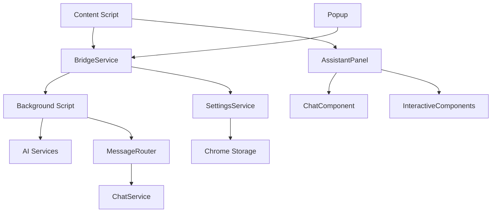

# 微信读书深度阅读助手 (WeRead Deep Reading Assistant)

[](https://opensource.org/licenses/MIT)
[](https://chrome.google.com/webstore)
[](https://github.com/lagrangee/weread_deepreading)

## 📖 项目介绍

微信读书深度阅读助手是一个Chrome浏览器扩展，通过集成多个AI大模型，为微信读书用户提供智能阅读辅助功能。支持文本解释、内容消化、多角度分析等功能，让阅读更加深入和高效。

## ✨ 核心功能

### 🎯 三大AI助手功能

1. **💡 解释一下 (Explain)**
   - 对选中文本进行术语解释、背景补充
   - 快捷键：`E`
   - 适用场景：专业术语、人名、概念等

2. **📖 消化一下 (Digest)**  
   - 将复杂内容转化为易理解的解读
   - 包含：核心观点、思想流派、历史演进
   - 快捷键：`X`
   - 适用场景：长段落、复杂理论

3. **👂 兼听一下 (Analyze)**
   - 提供多角度分析和不同观点
   - 包含：支持/反对论据、学者观点、扩展阅读
   - 快捷键：`M`
   - 适用场景：争议性内容、观点分析

### 🔧 技术特性

- **多AI服务商支持**：文心一言、通义千问、豆包、DeepSeek
- **智能面板系统**：浮动/内嵌模式切换，支持拖拽和调整大小
- **会话式交互**：支持连续对话，保持上下文
- **Markdown渲染**：富文本显示，支持代码高亮
- **本地存储**：API Key安全存储，设置自动同步
- **快捷键支持**：全局快捷键，提升使用效率

## 🏗️ 项目架构

### 📁 目录结构

```
src/
├── shared/                 # 共享模块
│   ├── config.js          # 全局配置
│   ├── message-types.js   # 消息类型定义
│   ├── bridge-service.js  # 通信桥接服务
│   └── settings-service.js # 设置管理服务
├── background/             # 后台脚本
│   ├── background.js      # 主入口
│   └── services/
│       └── chat-service.js # AI聊天服务
├── content/               # 内容脚本
│   ├── content.js        # 主入口
│   ├── components/       # UI组件
│   │   ├── assistant-panel.js # 主面板组件
│   │   ├── chat/         # 聊天组件
│   │   ├── help-modal/   # 帮助模态框
│   │   └── interactive/  # 交互组件(拖拽、调整大小)
│   ├── services/         # 业务服务
│   │   ├── chat-service.js    # 聊天服务
│   │   └── content-bridge.js  # 内容桥接
│   └── utils/            # 工具函数
│       ├── dom-utils.js  # DOM操作工具
│       └── event-utils.js # 事件处理工具
├── popup/                # 弹出窗口
│   ├── popup.html       # 设置界面
│   ├── popup.css        # 样式文件
│   └── popup.js         # 设置逻辑
└── lib/                 # 第三方库
    └── marked.min.js    # Markdown解析器
```

### 🔄 架构设计



## 🚀 快速开始

### 📋 环境要求

- **Chrome浏览器** >= 88
- **Node.js** >= 14.0.0
- **npm** >= 6.0.0

### 🛠️ 安装步骤

1. **克隆项目**
```bash
git clone https://github.com/lagrangee/weread_deepreading.git
cd weread_deepreading
```

2. **安装依赖**
```bash
npm install
```

3. **开发模式构建**
```bash
npm start
# 或者
npm run dev
```

4. **生产模式构建**
```bash
npm run build
```

5. **加载到Chrome**
   - 打开 `chrome://extensions/`
   - 开启"开发者模式"
   - 点击"加载已解压的扩展程序"
   - 选择 `dist` 目录

### ⚙️ 配置API Key

1. 点击扩展图标打开设置面板
2. 选择AI服务商（文心一言/通义千问/豆包/DeepSeek）
3. 输入对应的API Key
4. 点击"测试"验证连接
5. 保存设置

## 📖 使用指南

### 🎮 基本操作

1. **选择文本**：在微信读书页面选中要分析的文本
2. **选择功能**：点击对应的AI按钮或使用快捷键
   - `E` - 解释一下
   - `X` - 消化一下  
   - `M` - 兼听一下
3. **查看结果**：AI分析结果会显示在助手面板中
4. **继续对话**：可以在输入框中继续提问

### ⌨️ 快捷键

| 快捷键 | 功能 | 说明 |
|--------|------|------|
| `E` | 解释一下 | 解释选中文本 |
| `X` | 消化一下 | 消化选中内容 |
| `M` | 兼听一下 | 多角度分析 |
| `Esc` | 关闭面板 | 隐藏助手面板 |
| `?` | 帮助信息 | 显示帮助模态框 |

### 🎨 界面模式

- **浮动模式**：面板浮动在页面上方，可自由拖拽和调整大小
- **内嵌模式**：面板嵌入页面右侧，与页面内容并排显示

## 🔧 开发指南

### 📝 开发规范

- **代码风格**：遵循ESLint和Prettier配置
- **注释规范**：使用JSDoc格式，中文注释
- **命名规范**：
  - 类名：PascalCase
  - 方法名：camelCase
  - 常量：UPPER_SNAKE_CASE
  - 私有字段：以`#`开头

### 🏗️ 架构原则

1. **模块化设计**：按功能域划分模块
2. **单一职责**：每个类/模块只负责一个功能
3. **依赖注入**：避免硬编码依赖
4. **错误处理**：统一的错误处理机制
5. **性能优化**：懒加载、缓存、防抖等

### 🧪 测试

```bash
# 运行测试
npm test

# 监听模式
npm run test:watch

# 代码检查
npm run lint

# 自动修复
npm run lint:fix
```

### 🐛 调试

1. **Background Script调试**
   - 访问 `chrome://extensions/`
   - 点击扩展的"背景页"链接

2. **Content Script调试**
   - 在微信读书页面按F12
   - 查看Console面板的日志

3. **Popup调试**
   - 右键扩展图标
   - 选择"检查弹出内容"

## 📚 API文档

### 🔌 BridgeService

统一的跨环境通信服务：

```javascript
// 发送消息
await bridge.sendMessage(type, data, options);

// 注册处理器
bridge.on(type, handler);

// 广播消息
await bridge.broadcast(type, data);
```

### 🗃️ SettingsService

设置管理服务：

```javascript
// 保存设置
await settingsService.saveProvider(provider);
await settingsService.saveAPIKeys(apiKeys);

// 加载设置
const provider = await settingsService.loadProvider();
const apiKeys = await settingsService.loadAPIKeys();
```

### 🤖 ChatService

AI聊天服务：

```javascript
// 发送AI请求
const response = await chatService.sendMessage({
  text: '要分析的文本',
  type: 'explain', // 'explain' | 'digest' | 'analyze'
  provider: 'doubao'
});
```

## 🔒 安全性

### 🛡️ 数据安全

- **API Key加密存储**：使用Chrome Storage API安全存储
- **本地数据处理**：用户数据不上传到服务器
- **权限最小化**：只请求必要的Chrome权限

### 📋 权限说明

```json
{
  "permissions": [
    "storage",           // 存储用户设置
    "activeTab"          // 访问当前标签页
  ],
  "host_permissions": [
    "https://weread.qq.com/*"  // 微信读书域名
  ]
}
```

## 🚀 部署发布

### 📦 打包

```bash
# 生产构建
npm run build

# 打包为zip文件
npm run package
```

### 🏪 Chrome Web Store发布

1. 访问 [Chrome开发者控制台](https://chrome.google.com/webstore/developer/dashboard)
2. 上传打包后的zip文件
3. 填写扩展信息和描述
4. 提交审核

## 🤝 贡献指南

### 🔄 开发流程

1. Fork项目
2. 创建功能分支：`git checkout -b feature/amazing-feature`
3. 提交更改：`git commit -m 'Add amazing feature'`
4. 推送分支：`git push origin feature/amazing-feature`
5. 创建Pull Request

### 📋 提交规范

```
feat: 新功能
fix: 修复bug
docs: 文档更新
style: 代码格式调整
refactor: 代码重构
test: 测试用例
chore: 构建过程或辅助工具的变动
```

## 📈 版本历史

### v1.1.2 (2025-06-05)
- 🐛 修复 inline 模式下每次复制都会触发页面刷新的bug

### v1.1.1 (2025-06-05)
- 📝 修复 popup 初始状态错误

### v1.1.0 (2025-06-04)
- ✨ 新增流式响应支持，AI回答实时显示
- 🚀 优化响应速度，提升用户体验
- 🔧 改进错误处理机制
- 🎨 界面细节优化和动画效果提升
- 📱 响应式设计改进

### v1.0.0 (2025-05-29)
- ✨ 初始版本发布
- 🎯 三大AI功能：解释、消化、兼听
- 🔧 多AI服务商支持
- 🎨 智能面板系统
- ⌨️ 快捷键支持

## 🔮 未来计划

- [ ] 支持更多AI服务商
- [ ] 用户自定义提示词
- [ ] 阅读笔记管理
- [ ] 多语言支持
- [ ] 移动端适配

## 📄 许可证

本项目采用 [MIT License](LICENSE) 许可证。

## 📞 联系方式

- **作者**：lagrangee@gmail.com
- **项目地址**：https://github.com/lagrangee/weread_deepreading
- **问题反馈**：https://github.com/lagrangee/weread_deepreading/issues

## 🙏 致谢

感谢以下开源项目：
- [marked](https://github.com/markedjs/marked) - Markdown解析器
- [webpack](https://webpack.js.org/) - 模块打包工具
- [babel](https://babeljs.io/) - JavaScript编译器

---

⭐ 如果这个项目对你有帮助，请给个Star支持一下！
