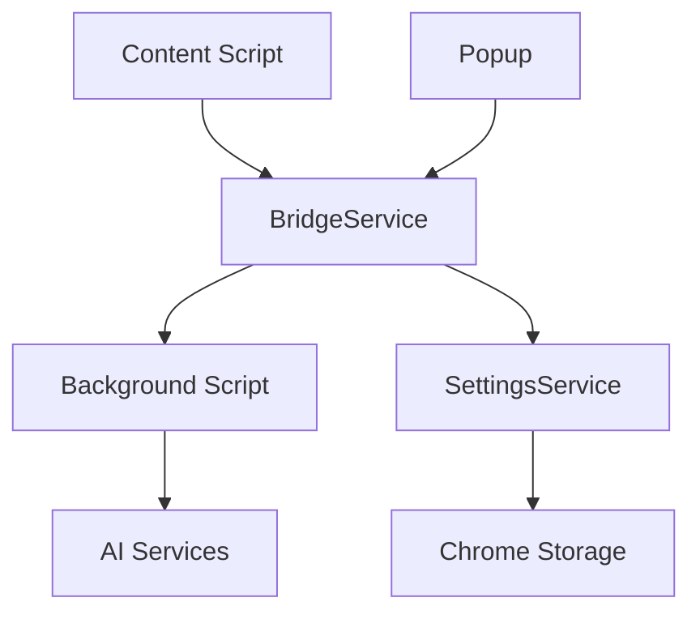

# 微信读书深度阅读助手 - API文档

## 📋 概述

本文档详细描述了微信读书深度阅读助手的API接口、数据结构和使用方法。

## 🏗️ 架构概览



## 🔌 BridgeService API

### 概述

BridgeService 是统一的跨环境通信服务，负责处理 Content Script、Background Script 和 Popup 之间的消息传递。

### 类定义

```javascript
class BridgeService {
  constructor(environment)
  async sendMessage(type, data, options)
  on(type, handler)
  off(type, handler)
  async broadcast(type, data)
  destroy()
}
```

### 方法详情

#### `constructor(environment)`

创建 BridgeService 实例。

**参数:**
- `environment` (string): 运行环境，可选值：`'content'`、`'background'`、`'popup'`

**示例:**
```javascript
const bridge = new BridgeService('content');
```

#### `sendMessage(type, data, options)`

发送消息到指定目标。

**参数:**
- `type` (string): 消息类型，参考 [消息类型](#消息类型)
- `data` (object): 消息数据
- `options` (object): 可选配置
  - `target` (string): 目标环境，默认为 `'background'`
  - `timeout` (number): 超时时间（毫秒），默认 5000

**返回值:**
- `Promise<any>`: 响应数据

**示例:**
```javascript
// 发送AI请求
const response = await bridge.sendMessage('CHAT_REQUEST', {
  text: '解释一下这个概念',
  action: 'explain',
  provider: 'doubao',
  book: '《思考，快与慢》',
  author: '丹尼尔·卡尼曼'
});

// 发送设置变更通知
await bridge.sendMessage('SETTINGS_CHANGED', {
  provider: 'doubao',
  apiKeys: { doubao: 'new-api-key' }
}, { target: 'content' });
```

#### `on(type, handler)`

注册消息处理器。

**参数:**
- `type` (string): 消息类型
- `handler` (function): 处理函数

**示例:**
```javascript
bridge.on('CHAT_RESPONSE', (data) => {
  console.log('收到AI响应:', data.response);
});

bridge.on('SETTINGS_CHANGED', (data) => {
  console.log('设置已更新:', data);
});
```

#### `off(type, handler)`

移除消息处理器。

**参数:**
- `type` (string): 消息类型
- `handler` (function): 要移除的处理函数

#### `broadcast(type, data)`

广播消息到所有环境。

**参数:**
- `type` (string): 消息类型
- `data` (object): 消息数据

**示例:**
```javascript
// 广播设置变更
await bridge.broadcast('SETTINGS_CHANGED', {
  provider: 'doubao'
});
```

#### `destroy()`

销毁 BridgeService 实例，清理所有事件监听器。

## 🤖 ChatService API

### 概述

ChatService 负责处理AI聊天请求，支持多个AI服务商。

### 类定义

```javascript
class ChatService {
  constructor(bridge)
  async sendMessage(options)
  async testApiConnection(provider, apiKey)
  buildPrompts(action, text, book, author, context)
}
```

### 方法详情

#### `sendMessage(options)`

发送AI聊天请求。

**参数:**
- `options` (object): 请求选项
  - `text` (string): 要分析的文本
  - `action` (string): 操作类型，可选值：`'explain'`、`'digest'`、`'analyze'`
  - `provider` (string): AI服务商
  - `book` (string): 书名
  - `author` (string): 作者
  - `context` (array): 对话上下文，可选

**返回值:**
- `Promise<object>`: AI响应结果
  - `success` (boolean): 请求是否成功
  - `response` (string): AI回复内容
  - `error` (string): 错误信息（如果失败）

**示例:**
```javascript
const chatService = new ChatService(bridge);

const result = await chatService.sendMessage({
  text: '自由意志是否存在？',
  action: 'analyze',
  provider: 'doubao',
  book: '《自由意志》',
  author: '萨姆·哈里斯'
});

if (result.success) {
  console.log('AI回复:', result.response);
} else {
  console.error('请求失败:', result.error);
}
```

#### `testApiConnection(provider, apiKey)`

测试API连接。

**参数:**
- `provider` (string): AI服务商
- `apiKey` (string): API密钥

**返回值:**
- `Promise<object>`: 测试结果
  - `success` (boolean): 连接是否成功
  - `error` (string): 错误信息（如果失败）

**示例:**
```javascript
const result = await chatService.testApiConnection('doubao', 'your-api-key');
if (result.success) {
  console.log('API连接成功');
} else {
  console.error('连接失败:', result.error);
}
```

## 🗃️ SettingsService API

### 概述

SettingsService 负责管理用户设置，包括API密钥、服务商选择等。

### 类定义

```javascript
class SettingsService {
  constructor()
  async saveAPIKeys(apiKeys)
  async loadAPIKeys()
  async saveProvider(provider)
  async loadProvider()
  async saveFloating(floating)
  async loadFloating()
  async saveMode(mode)
  async loadMode()
}
```

### 方法详情

#### `saveAPIKeys(apiKeys)` / `loadAPIKeys()`

保存/加载API密钥。

**参数:**
- `apiKeys` (object): API密钥对象

**示例:**
```javascript
const settingsService = new SettingsService();

// 保存API密钥
await settingsService.saveAPIKeys({
  doubao: 'your-doubao-key',
  qianwen: 'your-qianwen-key',
  wenxin: 'your-wenxin-key',
  deepseek: 'your-deepseek-key'
});

// 加载API密钥
const apiKeys = await settingsService.loadAPIKeys();
console.log('当前API密钥:', apiKeys);
```

#### `saveProvider(provider)` / `loadProvider()`

保存/加载当前AI服务商。

**参数:**
- `provider` (string): 服务商名称

**示例:**
```javascript
// 保存服务商
await settingsService.saveProvider('doubao');

// 加载服务商
const provider = await settingsService.loadProvider();
console.log('当前服务商:', provider);
```

#### `saveFloating(floating)` / `loadFloating()`

保存/加载浮动状态。

**参数:**
- `floating` (boolean): 是否浮动

#### `saveMode(mode)` / `loadMode()`

保存/加载显示模式。

**参数:**
- `mode` (string): 显示模式，`'floating'` 或 `'inline'`

## 🎨 AssistantPanel API

### 概述

AssistantPanel 是主要的UI组件，负责显示聊天界面和处理用户交互。

### 类定义

```javascript
class AssistantPanel {
  constructor()
  static getInstance()
  show()
  hide()
  toggle()
  updateBookInfo(bookName, authorName)
  addMessage(message)
  clearMessages()
  setButtonLoading(action, loading)
}
```

### 方法详情

#### `getInstance()`

获取单例实例。

**返回值:**
- `AssistantPanel`: 单例实例

**示例:**
```javascript
const panel = AssistantPanel.getInstance();
```

#### `show()` / `hide()` / `toggle()`

显示/隐藏/切换面板。

**示例:**
```javascript
panel.show();    // 显示面板
panel.hide();    // 隐藏面板
panel.toggle();  // 切换显示状态
```

#### `updateBookInfo(bookName, authorName)`

更新书籍信息。

**参数:**
- `bookName` (string): 书名
- `authorName` (string): 作者

**示例:**
```javascript
panel.updateBookInfo('《思考，快与慢》', '丹尼尔·卡尼曼');
```

#### `addMessage(message)`

添加消息到聊天界面。

**参数:**
- `message` (object): 消息对象
  - `type` (string): 消息类型，`'user'` 或 `'ai'`
  - `content` (string): 消息内容
  - `timestamp` (number): 时间戳

**示例:**
```javascript
// 添加用户消息
panel.addMessage({
  type: 'user',
  content: '请解释一下这个概念',
  timestamp: Date.now()
});

// 添加AI回复
panel.addMessage({
  type: 'ai',
  content: '这个概念是指...',
  timestamp: Date.now()
});
```

#### `setButtonLoading(action, loading)`

设置按钮加载状态。

**参数:**
- `action` (string): 操作类型，`'explain'`、`'digest'`、`'analyze'`
- `loading` (boolean): 是否加载中

**示例:**
```javascript
// 设置解释按钮为加载状态
panel.setButtonLoading('explain', true);

// 恢复按钮状态
panel.setButtonLoading('explain', false);
```

## 📊 数据结构

### 消息类型

#### Background 消息类型

```javascript
const BACKGROUND_MESSAGES = {
  CHAT: {
    REQUEST: 'CHAT_REQUEST',     // AI请求
    RESPONSE: 'CHAT_RESPONSE',   // AI响应
    TEST_API_KEY: 'TEST_API_KEY' // 测试API密钥
  }
}
```

#### Popup 消息类型

```javascript
const POPUP_MESSAGES = {
  SETTINGS: {
    GET: 'SETTINGS_GET',         // 获取设置
    SET: 'SETTINGS_SET',         // 保存设置
    CHANGED: 'SETTINGS_CHANGED'  // 设置变更通知
  },
  SYSTEM: {
    STATUS: 'SYSTEM_STATUS'      // 获取系统状态
  }
}
```

### 消息数据结构

#### CHAT_REQUEST

```javascript
{
  text: string,        // 要分析的文本
  action: string,      // 操作类型：'explain' | 'digest' | 'analyze'
  provider: string,    // AI服务商
  book: string,        // 书名
  author: string,      // 作者
  context?: array      // 对话上下文（可选）
}
```

#### CHAT_RESPONSE

```javascript
{
  success: boolean,    // 请求是否成功
  response?: string,   // AI回复内容
  error?: string       // 错误信息
}
```

#### SETTINGS_CHANGED

```javascript
{
  provider?: string,   // 当前服务商
  apiKeys?: object,    // API密钥
  floating?: boolean,  // 浮动状态
  mode?: string        // 显示模式
}
```

### 配置结构

#### AI服务商配置

```javascript
const AI_PROVIDERS = {
  doubao: {
    name: '豆包',
    apiUrl: 'https://ark.cn-beijing.volces.com/api/v3/chat/completions',
    model: 'ep-20241230140956-8xqzr',
    headers: {
      'Content-Type': 'application/json',
      'Authorization': 'Bearer {apiKey}'
    }
  },
  qianwen: {
    name: '通义千问',
    apiUrl: 'https://dashscope.aliyuncs.com/api/v1/services/aigc/text-generation/generation',
    model: 'qwen-turbo',
    headers: {
      'Content-Type': 'application/json',
      'Authorization': 'Bearer {apiKey}'
    }
  }
  // ... 其他服务商
}
```

#### 提示词模板

```javascript
const PROMPTS = {
  explain: {
    system: '你是一个专业的阅读助手...',
    user: '请解释以下内容：{text}\n\n书籍：{book}\n作者：{author}'
  },
  digest: {
    system: '你是一个专业的内容分析师...',
    user: '请消化以下内容：{text}\n\n书籍：{book}\n作者：{author}'
  },
  analyze: {
    system: '你是一个客观的分析师...',
    user: '请从多角度分析：{text}\n\n书籍：{book}\n作者：{author}'
  }
}
```

## 🔧 工具函数

### DOM工具

```javascript
// DOM操作工具函数
const DOMUtils = {
  createElement(tag, className, textContent),
  findElement(selector),
  removeElement(element),
  addClass(element, className),
  removeClass(element, className),
  toggleClass(element, className)
}
```

### 事件工具

```javascript
// 事件处理工具函数
const EventUtils = {
  on(type, handler),
  off(type, handler),
  emit(type, data),
  once(type, handler)
}
```

## 🚨 错误处理

### 错误类型

```javascript
const ERROR_TYPES = {
  NETWORK_ERROR: 'NETWORK_ERROR',           // 网络错误
  API_KEY_INVALID: 'API_KEY_INVALID',       // API密钥无效
  RATE_LIMIT: 'RATE_LIMIT',                 // 请求频率限制
  SERVICE_UNAVAILABLE: 'SERVICE_UNAVAILABLE', // 服务不可用
  INVALID_RESPONSE: 'INVALID_RESPONSE',     // 响应格式错误
  TIMEOUT: 'TIMEOUT'                        // 请求超时
}
```

### 错误处理示例

```javascript
try {
  const result = await chatService.sendMessage(options);
  if (!result.success) {
    switch (result.error) {
      case ERROR_TYPES.API_KEY_INVALID:
        showError('API密钥无效，请检查设置');
        break;
      case ERROR_TYPES.RATE_LIMIT:
        showError('请求过于频繁，请稍后再试');
        break;
      case ERROR_TYPES.NETWORK_ERROR:
        showError('网络连接失败，请检查网络');
        break;
      default:
        showError('请求失败，请重试');
    }
  }
} catch (error) {
  console.error('未知错误:', error);
  showError('系统错误，请重试');
}
```

## 📈 性能优化

### 缓存策略

```javascript
// 消息缓存
const MessageCache = {
  maxSize: 50,                    // 最大缓存数量
  ttl: 5 * 60 * 1000,           // 缓存时间（5分钟）
  
  set(key, value) {
    // 实现缓存逻辑
  },
  
  get(key) {
    // 获取缓存
  },
  
  clear() {
    // 清空缓存
  }
}
```

### 防抖处理

```javascript
// 防抖函数
function debounce(func, wait) {
  let timeout;
  return function executedFunction(...args) {
    const later = () => {
      clearTimeout(timeout);
      func(...args);
    };
    clearTimeout(timeout);
    timeout = setTimeout(later, wait);
  };
}

// 使用示例
const debouncedSendMessage = debounce(sendMessage, 300);
```

## 🧪 测试API

### 单元测试示例

```javascript
// BridgeService 测试
describe('BridgeService', () => {
  let bridge;
  
  beforeEach(() => {
    bridge = new BridgeService('content');
  });
  
  afterEach(() => {
    bridge.destroy();
  });
  
  test('should send message successfully', async () => {
    const response = await bridge.sendMessage('TEST_MESSAGE', { data: 'test' });
    expect(response).toBeDefined();
  });
  
  test('should register and trigger handler', () => {
    const handler = jest.fn();
    bridge.on('TEST_EVENT', handler);
    bridge.emit('TEST_EVENT', { data: 'test' });
    expect(handler).toHaveBeenCalledWith({ data: 'test' });
  });
});
```

### 集成测试示例

```javascript
// 完整流程测试
describe('AI Chat Flow', () => {
  test('should complete explain flow', async () => {
    const panel = AssistantPanel.getInstance();
    const chatService = new ChatService(bridge);
    
    // 模拟用户选择文本
    const selectedText = '自由意志';
    
    // 发送解释请求
    const result = await chatService.sendMessage({
      text: selectedText,
      action: 'explain',
      provider: 'doubao',
      book: '《自由意志》',
      author: '萨姆·哈里斯'
    });
    
    expect(result.success).toBe(true);
    expect(result.response).toBeDefined();
    
    // 验证消息添加到界面
    panel.addMessage({
      type: 'ai',
      content: result.response,
      timestamp: Date.now()
    });
  });
});
```

---

## 📚 参考资料

- [Chrome Extension Messaging](https://developer.chrome.com/docs/extensions/mv3/messaging/)
- [Chrome Storage API](https://developer.chrome.com/docs/extensions/reference/storage/)
- [JavaScript Promises](https://developer.mozilla.org/en-US/docs/Web/JavaScript/Reference/Global_Objects/Promise)
- [Event-Driven Architecture](https://en.wikipedia.org/wiki/Event-driven_architecture) 