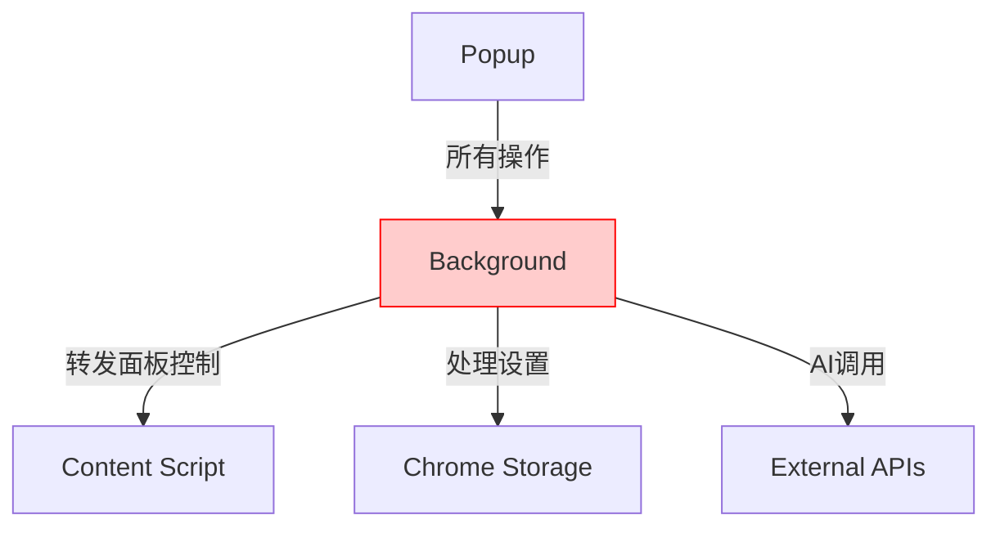
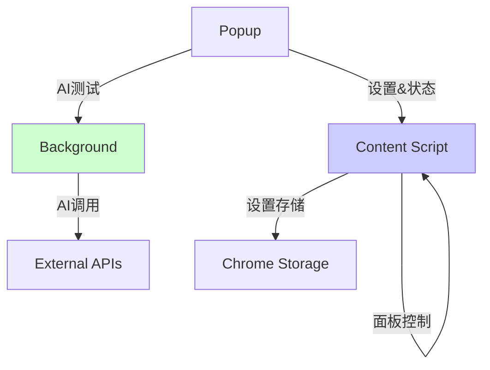
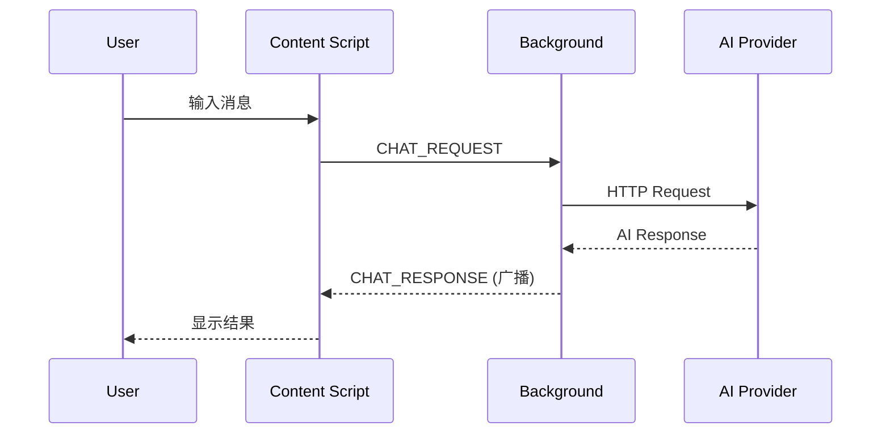
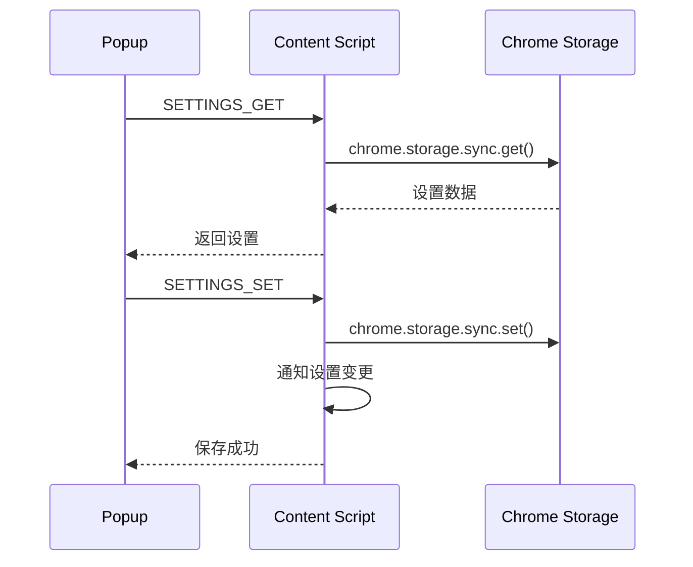
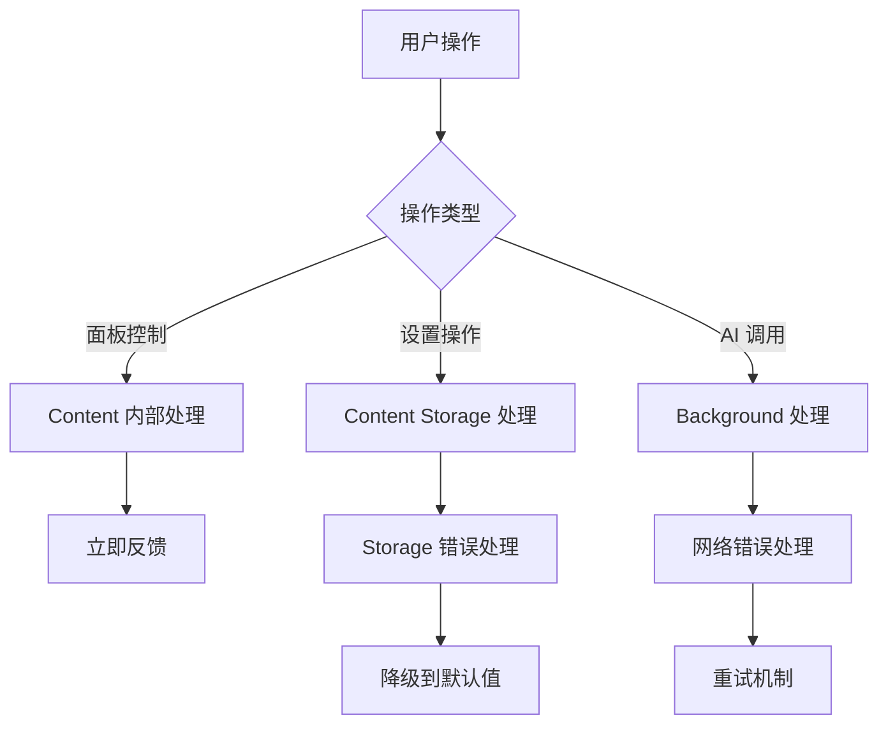
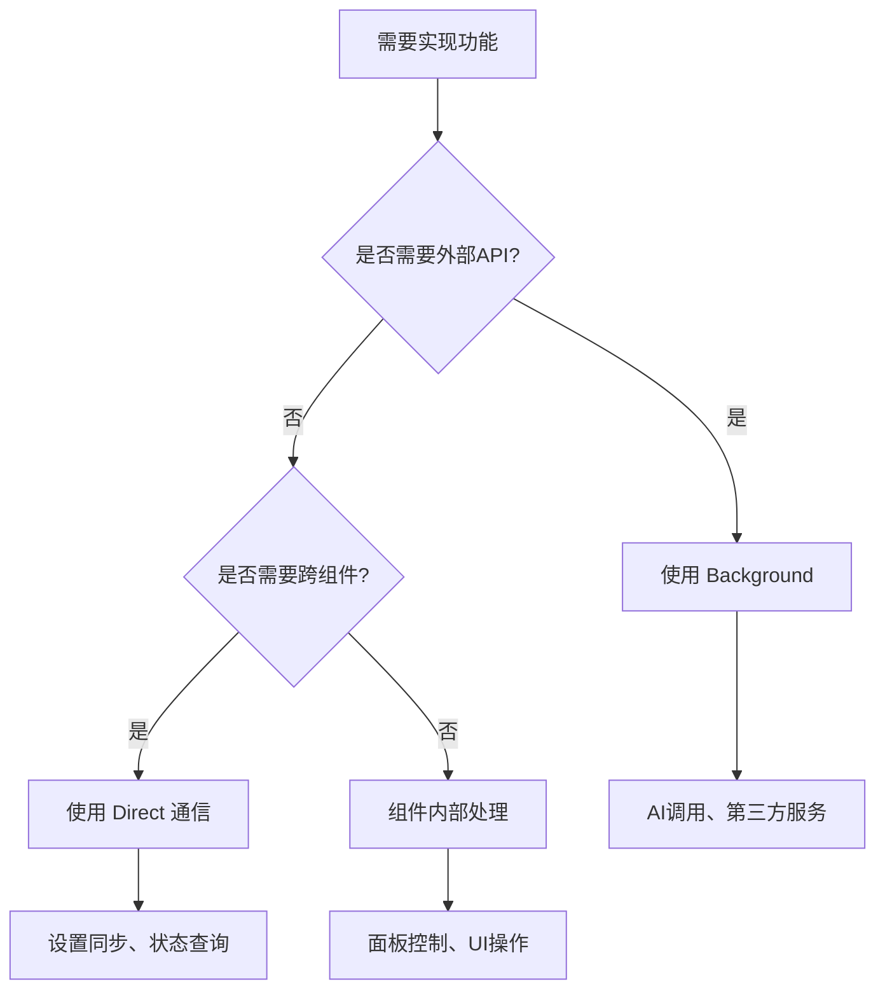

# 通信架构简化：最小化 Background，最大化 Content

## 🎯 架构设计原则

基于对Chrome扩展通信需求的深入分析，我们采用了极简化的架构设计：

1. **Background Script 最小化** - 仅处理必须的外部API调用
2. **Content Script 最大化** - 处理所有本地操作和存储
3. **Popup 轻量化** - 仅作为配置界面
4. **面板控制内部化** - 完全在 Content Script 内部处理

## 📊 架构对比

### 优化前：复杂的三层架构


### 优化后：简化的双重架构


## 🔗 详细通信流程

### 1. AI 聊天流程


### 2. 设置管理流程


### 3. 面板控制流程（内部化）
```mermaid
graph LR
    A[Pin 按钮点击] -->|直接调用| B[Panel.toggle()]
    C[快捷键 ESC] -->|直接调用| D[Panel.hide()]
    E[选中文本] -->|直接调用| F[Panel.show()]
    
    style A fill:#e1f5fe
    style C fill:#e1f5fe
    style E fill:#e1f5fe
```

## 🏗️ 组件职责划分

### Background Script (最小化)
```javascript
// 唯一职责：AI 服务调用
export const BACKGROUND_MESSAGES = {
  CHAT: {
    REQUEST: 'CHAT_REQUEST',   // AI 请求
    RESPONSE: 'CHAT_RESPONSE'  // AI 响应（广播）
  }
};
```

**为什么只有这个？**
- 受 CORS 限制，外部 API 调用必须在 Background
- 其他所有功能都可以在 Content Script 实现

### Content Script (核心功能)
```javascript
// 处理所有本地操作
export const CONTENT_FUNCTIONS = {
  STORAGE: ['设置读取', '设置保存', '默认值合并'],
  PANEL: ['显示/隐藏', '拖拽', '大小调整', '快捷键'],
  TEXT: ['选择监听', '内容解析'],
  UI: ['暗黑模式', '字体调整', '状态管理']
};
```

**为什么这么多？**
- Content Script 可以访问 chrome.storage
- 可以操作页面 DOM
- 不受跨域限制（在页面环境）

### Popup (配置界面)
```javascript
// 轻量级界面
export const POPUP_FUNCTIONS = {
  AI: ['API Key 配置', 'AI 服务测试'],
  STATUS: ['扩展状态查看', '健康检查'],
  SETTINGS: ['配置界面展示']
};
```

**为什么这么少？**
- 用户不会频繁打开 Popup
- 专注于配置而不是操作

## 📝 消息类型设计

### Background 消息（仅 AI）
```javascript
export const BACKGROUND_MESSAGES = {
  CHAT: {
    REQUEST: 'CHAT_REQUEST',   // Content → Background
    RESPONSE: 'CHAT_RESPONSE'  // Background → Content (广播)
  }
};
```

### Direct 消息（Popup ↔ Content）
```javascript
export const DIRECT_MESSAGES = {
  SETTINGS: {
    GET: 'SETTINGS_GET',       // Popup → Content
    SET: 'SETTINGS_SET',       // Popup → Content  
    CHANGED: 'SETTINGS_CHANGED' // Content → Popup
  },
  
  SYSTEM: {
    STATUS: 'SYSTEM_STATUS'    // Popup → Content
  }
};
```

## 🚀 性能优化效果

### 消息路径优化
| 操作 | 优化前 | 优化后 | 提升 |
|------|--------|--------|------|
| 面板切换 | Popup→Background→Content | 内部调用 | 🚀 100% |
| 设置保存 | Popup→Background→Storage | Popup→Content→Storage | ⚡ 33% |
| 状态查询 | Popup→Background→Content | Popup→Content | ⚡ 33% |

### 代码复杂度降低
| 组件 | 代码行数变化 | 职责数量 |
|------|-------------|----------|
| Background | -60% | 1个（仅AI） |
| Content | +20% | 6个（全功能） |
| Popup | -30% | 3个（配置） |

## 🔧 实现示例

### 1. 面板控制（完全内部化）
```javascript
// 在 AssistantPanel 内部
class AssistantPanel {
  constructor() {
    this.setupInternalControls();
  }
  
  setupInternalControls() {
    // Pin 按钮直接控制
    this.pinElement.onclick = () => this.toggle();
    
    // 快捷键直接控制
    document.onkeydown = (e) => {
      if (e.key === 'Escape') this.hide();
    };
    
    // 文本选择直接控制
    document.onselectionchange = () => {
      const text = getSelection().toString();
      if (text.length > 5) this.show({ text });
    };
  }
}
```

### 2. 设置管理（Content 直接操作）
```javascript
// 在 ContentBridge 内部
async saveSettingsToStorage(settings) {
  // 直接使用 Chrome API
  await chrome.storage.sync.set(settings);
  
  // 本地事件通知
  EventUtils.emit('settings:changed', settings);
}
```

### 3. AI 调用（唯一的 Background 功能）
```javascript
// Background 只处理这一个功能
this.bridge.on('CHAT_REQUEST', async (data) => {
  const response = await fetch(aiEndpoint, {
    method: 'POST',
    headers: { 'Authorization': `Bearer ${apiKey}` },
    body: JSON.stringify(data)
  });
  
  // 广播响应到所有监听者
  this.bridge.broadcast('CHAT_RESPONSE', response);
});
```

## 🛡️ 错误处理

### 分层错误处理


### 容错机制
1. **Storage 失败** → 使用内存中的默认值
2. **Background 断开** → AI 功能暂时不可用，其他功能正常
3. **Content Script 未响应** → Popup 显示刷新提示

## 📈 架构优势总结

### 1. 性能提升
- **零延迟面板控制** - 无需跨组件通信
- **快速设置响应** - 直接本地存储
- **最小网络开销** - 只有AI调用需要网络

### 2. 可靠性增强
- **独立性强** - 各组件故障不会相互影响
- **故障隔离** - Background 问题不影响本地功能
- **容错性好** - 多层降级方案

### 3. 维护性提升
- **职责清晰** - 每个组件职责单一
- **代码简洁** - 减少不必要的抽象
- **易于调试** - 问题定位更准确

### 4. 用户体验优化
- **响应迅速** - 本地操作零延迟
- **状态一致** - 数据流向清晰
- **功能稳定** - 核心功能不依赖网络

## 🎯 最佳实践建议

### 选择通信方式的决策树


### 开发指导原则
1. **能内部就内部** - 优先考虑组件内部实现
2. **能直接就直接** - 避免不必要的中转
3. **能本地就本地** - Chrome Storage 比 Background 更快
4. **最小化 Background** - 只用于必须的特权操作

这样的架构设计让扩展更快、更稳定、更容易维护，真正做到了"简单就是美"！ 