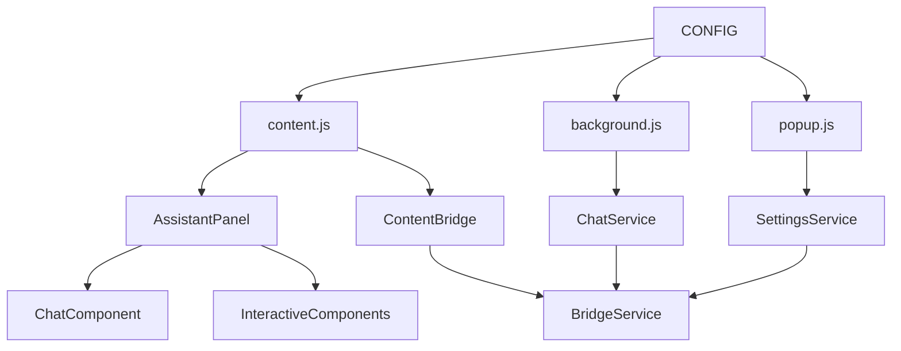

# 微信读书深度阅读助手 - 开发指南

## 📋 概述

本文档为开发者提供详细的开发指南，包括环境搭建、代码规范、调试技巧和最佳实践。

## 🛠️ 开发环境搭建

### 系统要求

- **操作系统**: macOS 10.15+, Windows 10+, Ubuntu 18.04+
- **Node.js**: >= 14.0.0
- **npm**: >= 6.0.0
- **Chrome**: >= 88 (支持 Manifest V3)
- **编辑器**: VS Code (推荐) 或其他支持 JavaScript 的编辑器

### 环境配置

#### 1. 克隆项目

```bash
git clone https://github.com/lagrangee/weread_deepreading.git
cd weread_deepreading
```

#### 2. 安装依赖

```bash
npm install
```

#### 3. 配置开发环境

```bash
# 复制环境配置文件
cp .env.example .env

# 编辑配置文件
vim .env
```

#### 4. VS Code 配置

安装推荐的扩展：

```json
{
  "recommendations": [
    "esbenp.prettier-vscode",
    "dbaeumer.vscode-eslint",
    "bradlc.vscode-tailwindcss",
    "ms-vscode.vscode-json",
    "formulahendry.auto-rename-tag"
  ]
}
```

配置 VS Code 设置：

```json
{
  "editor.formatOnSave": true,
  "editor.codeActionsOnSave": {
    "source.fixAll.eslint": true
  },
  "eslint.validate": ["javascript"],
  "prettier.requireConfig": true
}
```

## 🏗️ 项目结构详解

### 目录说明

```
weread_deepreading/
├── src/                    # 源代码目录
│   ├── shared/            # 共享模块
│   │   ├── config.js      # 全局配置
│   │   ├── message-types.js # 消息类型定义
│   │   ├── bridge-service.js # 通信桥接服务
│   │   └── settings-service.js # 设置管理服务
│   ├── background/        # 后台脚本
│   │   ├── background.js  # 主入口
│   │   └── services/      # 业务服务
│   │       └── chat-service.js # AI聊天服务
│   ├── content/          # 内容脚本
│   │   ├── content.js    # 主入口
│   │   ├── components/   # UI组件
│   │   ├── services/     # 业务服务
│   │   └── utils/        # 工具函数
│   ├── popup/            # 弹出窗口
│   │   ├── popup.html    # 设置界面
│   │   ├── popup.css     # 样式文件
│   │   └── popup.js      # 设置逻辑
│   └── lib/              # 第三方库
├── dist/                 # 构建输出目录
├── specs/                # 规格文档
├── docs/                 # 开发文档
├── tests/                # 测试文件
├── assets/               # 静态资源
├── webpack.config.js     # Webpack配置
├── package.json          # 项目配置
├── .eslintrc.js         # ESLint配置
├── .prettierrc          # Prettier配置
└── manifest.json        # Chrome扩展配置
```

### 模块依赖关系



## 📝 代码规范

### JavaScript 规范

#### 1. 命名规范

```javascript
// 类名：PascalCase
class AssistantPanel {}
class ChatService {}

// 方法名：camelCase
function sendMessage() {}
function updateBookInfo() {}

// 常量：UPPER_SNAKE_CASE
const API_TIMEOUT = 5000;
const MESSAGE_TYPES = {};

// 私有字段：以 # 开头
class MyClass {
  #privateField = 'value';
  #privateMethod() {}
}

// 文件名：kebab-case
// assistant-panel.js
// chat-service.js
// message-types.js
```

#### 2. 注释规范

```javascript
/**
 * @file 文件功能描述
 * @description 详细描述文件的作用和功能
 * @author lagrangee
 * @date 2024-01-01
 */

/**
 * 发送AI聊天请求
 * @param {Object} options - 请求选项
 * @param {string} options.text - 要分析的文本
 * @param {string} options.action - 操作类型
 * @param {string} options.provider - AI服务商
 * @returns {Promise<Object>} AI响应结果
 * @throws {Error} 当API密钥无效时抛出错误
 * @example
 * const result = await sendMessage({
 *   text: '自由意志',
 *   action: 'explain',
 *   provider: 'doubao'
 * });
 */
async function sendMessage(options) {
  // 实现逻辑
}

/**
 * 助手面板组件
 * @class
 * @description 管理AI助手的用户界面和交互
 * @example
 * const panel = AssistantPanel.getInstance();
 * panel.show();
 */
class AssistantPanel {
  /** 面板是否显示 */
  #isShowing = false;
  
  /**
   * 显示面板
   * @public
   */
  show() {
    // 实现逻辑
  }
}
```

#### 3. 错误处理规范

```javascript
// 统一错误处理
class APIError extends Error {
  constructor(message, code, details) {
    super(message);
    this.name = 'APIError';
    this.code = code;
    this.details = details;
  }
}

// 异步函数错误处理
async function sendAIRequest(options) {
  try {
    const response = await fetch(url, requestOptions);
    
    if (!response.ok) {
      throw new APIError(
        `API请求失败: ${response.status}`,
        'API_REQUEST_FAILED',
        { status: response.status, url }
      );
    }
    
    return await response.json();
  } catch (error) {
    if (error instanceof APIError) {
      throw error;
    }
    
    // 网络错误或其他未知错误
    throw new APIError(
      '网络请求失败',
      'NETWORK_ERROR',
      { originalError: error.message }
    );
  }
}

// Promise 错误处理
sendAIRequest(options)
  .then(result => {
    // 处理成功结果
  })
  .catch(error => {
    if (error.code === 'API_KEY_INVALID') {
      showError('API密钥无效，请检查设置');
    } else if (error.code === 'NETWORK_ERROR') {
      showError('网络连接失败，请检查网络');
    } else {
      showError('请求失败，请重试');
    }
    
    // 记录错误日志
    console.error('AI请求失败:', error);
  });
```

### CSS 规范

#### 1. 命名规范

```css
/* BEM 命名规范 */
.assistant-panel {}                    /* 块 */
.assistant-panel__header {}            /* 元素 */
.assistant-panel__header--collapsed {} /* 修饰符 */

/* 组件前缀 */
.wr-assistant-panel {}     /* WeRead Assistant Panel */
.wr-chat-message {}        /* WeRead Chat Message */
.wr-ai-button {}          /* WeRead AI Button */

/* 状态类 */
.is-loading {}
.is-visible {}
.is-disabled {}

/* 工具类 */
.u-text-center {}         /* utility text center */
.u-margin-bottom {}       /* utility margin bottom */
```

#### 2. 样式组织

```css
/* 1. 重置和基础样式 */
.wr-assistant-panel {
  /* 布局属性 */
  position: fixed;
  top: 100px;
  right: 20px;
  width: 400px;
  height: 600px;
  
  /* 盒模型属性 */
  padding: 16px;
  margin: 0;
  border: 1px solid #e9ecef;
  border-radius: 8px;
  
  /* 视觉属性 */
  background-color: #ffffff;
  box-shadow: 0 4px 12px rgba(0, 0, 0, 0.1);
  
  /* 字体属性 */
  font-family: -apple-system, BlinkMacSystemFont, 'Segoe UI', Roboto;
  font-size: 14px;
  line-height: 1.5;
  
  /* 其他属性 */
  z-index: 10000;
  transition: all 0.3s ease;
}

/* 2. 状态变化 */
.wr-assistant-panel.is-loading {
  opacity: 0.7;
  pointer-events: none;
}

/* 3. 响应式设计 */
@media (max-width: 768px) {
  .wr-assistant-panel {
    width: 90vw;
    height: 70vh;
    top: 50%;
    left: 50%;
    transform: translate(-50%, -50%);
  }
}
```

## 🔧 开发工作流

### 1. 功能开发流程

```bash
# 1. 创建功能分支
git checkout -b feature/new-ai-provider

# 2. 开发模式启动
npm start

# 3. 实时开发
# 修改代码 -> 自动构建 -> 手动刷新扩展

# 4. 运行测试
npm test

# 5. 代码检查
npm run lint

# 6. 提交代码
git add .
git commit -m "feat: 添加新的AI服务商支持"

# 7. 推送分支
git push origin feature/new-ai-provider
```

### 2. 调试技巧

#### Background Script 调试

```javascript
// 1. 在 chrome://extensions/ 点击"背景页"
// 2. 在 DevTools Console 中调试

// 添加调试日志
console.log('[Background] 收到消息:', message);
console.error('[Background] 错误:', error);

// 使用 debugger 断点
async function handleChatRequest(data) {
  debugger; // 在这里暂停执行
  const result = await sendAIRequest(data);
  return result;
}
```

#### Content Script 调试

```javascript
// 1. 在微信读书页面按 F12
// 2. 在 Console 中查看日志

// 检查组件状态
console.log('[Content] 面板状态:', panel.isShowing);
console.log('[Content] 当前设置:', await settingsService.loadProvider());

// 手动触发功能
const panel = AssistantPanel.getInstance();
panel.show();
```

#### Popup 调试

```javascript
// 1. 右键扩展图标 -> "检查弹出内容"
// 2. 在 DevTools 中调试

// 检查设置状态
console.log('[Popup] 当前设置:', settings);

// 测试API连接
testConnection('doubao', 'your-api-key');
```

### 3. 性能分析

#### 内存使用监控

```javascript
// 监控内存使用
function monitorMemory() {
  if (performance.memory) {
    console.log('内存使用情况:', {
      used: Math.round(performance.memory.usedJSHeapSize / 1024 / 1024) + 'MB',
      total: Math.round(performance.memory.totalJSHeapSize / 1024 / 1024) + 'MB',
      limit: Math.round(performance.memory.jsHeapSizeLimit / 1024 / 1024) + 'MB'
    });
  }
}

// 定期监控
setInterval(monitorMemory, 10000);
```

#### 性能指标收集

```javascript
// 测量函数执行时间
function measurePerformance(fn, name) {
  return async function(...args) {
    const start = performance.now();
    const result = await fn.apply(this, args);
    const end = performance.now();
    console.log(`[Performance] ${name} 执行时间: ${end - start}ms`);
    return result;
  };
}

// 使用示例
const measuredSendMessage = measurePerformance(sendMessage, 'AI请求');
```

## 🧪 测试指南

### 1. 单元测试

#### 测试环境配置

```javascript
// jest.config.js
module.exports = {
  testEnvironment: 'jsdom',
  setupFilesAfterEnv: ['<rootDir>/tests/setup.js'],
  moduleNameMapping: {
    '^@/(.*)$': '<rootDir>/src/$1'
  },
  collectCoverageFrom: [
    'src/**/*.js',
    '!src/lib/**',
    '!src/**/*.test.js'
  ],
  coverageThreshold: {
    global: {
      branches: 80,
      functions: 80,
      lines: 80,
      statements: 80
    }
  }
};
```

#### 测试示例

```javascript
// tests/services/chat-service.test.js
import { ChatService } from '@/background/services/chat-service.js';
import { BridgeService } from '@/shared/bridge-service.js';

describe('ChatService', () => {
  let chatService;
  let mockBridge;

  beforeEach(() => {
    mockBridge = {
      sendMessage: jest.fn(),
      on: jest.fn(),
      off: jest.fn()
    };
    chatService = new ChatService(mockBridge);
  });

  describe('sendMessage', () => {
    test('应该成功发送AI请求', async () => {
      // 模拟API响应
      const mockResponse = {
        success: true,
        response: '这是AI的回复'
      };

      // 模拟fetch响应
      global.fetch = jest.fn().mockResolvedValue({
        ok: true,
        json: () => Promise.resolve({
          choices: [{ message: { content: mockResponse.response } }]
        })
      });

      const result = await chatService.sendMessage({
        text: '测试文本',
        action: 'explain',
        provider: 'doubao',
        book: '测试书籍',
        author: '测试作者'
      });

      expect(result.success).toBe(true);
      expect(result.response).toBe(mockResponse.response);
    });

    test('应该处理API错误', async () => {
      // 模拟API错误
      global.fetch = jest.fn().mockResolvedValue({
        ok: false,
        status: 401,
        statusText: 'Unauthorized'
      });

      const result = await chatService.sendMessage({
        text: '测试文本',
        action: 'explain',
        provider: 'doubao',
        book: '测试书籍',
        author: '测试作者'
      });

      expect(result.success).toBe(false);
      expect(result.error).toContain('API密钥无效');
    });
  });
});
```

### 2. 集成测试

```javascript
// tests/integration/ai-flow.test.js
import { AssistantPanel } from '@/content/components/assistant-panel.js';
import { ChatService } from '@/content/services/chat-service.js';

describe('AI功能集成测试', () => {
  let panel;
  let chatService;

  beforeEach(() => {
    // 设置DOM环境
    document.body.innerHTML = '<div id="test-container"></div>';
    
    panel = AssistantPanel.getInstance();
    chatService = new ChatService();
  });

  test('完整的解释流程', async () => {
    // 1. 显示面板
    panel.show();
    expect(panel.isShowing).toBe(true);

    // 2. 模拟文本选择
    const selectedText = '自由意志';
    
    // 3. 点击解释按钮
    const explainButton = document.querySelector('.wr-ai-button--explain');
    explainButton.click();

    // 4. 验证按钮状态
    expect(explainButton.classList.contains('is-loading')).toBe(true);

    // 5. 等待AI响应
    await new Promise(resolve => setTimeout(resolve, 100));

    // 6. 验证消息添加
    const messages = document.querySelectorAll('.wr-chat-message');
    expect(messages.length).toBeGreaterThan(0);

    // 7. 验证按钮状态恢复
    expect(explainButton.classList.contains('is-loading')).toBe(false);
  });
});
```

### 3. E2E 测试

```javascript
// tests/e2e/extension.test.js
const puppeteer = require('puppeteer');
const path = require('path');

describe('Chrome扩展E2E测试', () => {
  let browser;
  let page;

  beforeAll(async () => {
    // 启动Chrome并加载扩展
    browser = await puppeteer.launch({
      headless: false,
      args: [
        `--load-extension=${path.join(__dirname, '../../dist')}`,
        '--disable-extensions-except=' + path.join(__dirname, '../../dist')
      ]
    });

    page = await browser.newPage();
  });

  afterAll(async () => {
    await browser.close();
  });

  test('应该在微信读书页面正常工作', async () => {
    // 1. 访问微信读书
    await page.goto('https://weread.qq.com');

    // 2. 等待页面加载
    await page.waitForSelector('body');

    // 3. 检查扩展是否注入
    const assistantPanel = await page.$('.wr-assistant-panel');
    expect(assistantPanel).toBeTruthy();

    // 4. 模拟文本选择
    await page.evaluate(() => {
      const range = document.createRange();
      const textNode = document.createTextNode('测试文本');
      document.body.appendChild(textNode);
      range.selectNode(textNode);
      window.getSelection().addRange(range);
    });

    // 5. 点击解释按钮
    await page.click('.wr-ai-button--explain');

    // 6. 等待AI响应
    await page.waitForSelector('.wr-chat-message--ai', { timeout: 10000 });

    // 7. 验证响应内容
    const aiMessage = await page.$eval('.wr-chat-message--ai', el => el.textContent);
    expect(aiMessage.length).toBeGreaterThan(0);
  });
});
```

## 🚀 构建和部署

### 1. 构建配置

#### Webpack 配置优化

```javascript
// webpack.config.js
const path = require('path');
const CopyWebpackPlugin = require('copy-webpack-plugin');
const MiniCssExtractPlugin = require('mini-css-extract-plugin');

module.exports = (env, argv) => {
  const isProduction = argv.mode === 'production';
  
  return {
    mode: isProduction ? 'production' : 'development',
    devtool: isProduction ? false : 'cheap-module-source-map',
    
    entry: {
      background: './src/background/background.js',
      content: './src/content/content.js',
      popup: './src/popup/popup.js'
    },
    
    output: {
      path: path.resolve(__dirname, 'dist'),
      filename: '[name].bundle.js',
      clean: true
    },
    
    optimization: {
      splitChunks: {
        cacheGroups: {
          vendor: {
            test: /[\\/]node_modules[\\/]/,
            name: 'vendor',
            chunks: 'all'
          }
        }
      }
    },
    
    module: {
      rules: [
        {
          test: /\.js$/,
          exclude: /node_modules/,
          use: {
            loader: 'babel-loader',
            options: {
              presets: [
                ['@babel/preset-env', {
                  targets: { chrome: '88' },
                  modules: 'auto'
                }]
              ]
            }
          }
        },
        {
          test: /\.css$/,
          use: [
            isProduction ? MiniCssExtractPlugin.loader : 'style-loader',
            'css-loader',
            'postcss-loader'
          ]
        }
      ]
    },
    
    plugins: [
      new CopyWebpackPlugin({
        patterns: [
          { from: 'manifest.json', to: 'manifest.json' },
          { from: 'src/popup/popup.html', to: 'popup/popup.html' },
          { from: 'assets', to: 'assets' }
        ]
      }),
      
      ...(isProduction ? [
        new MiniCssExtractPlugin({
          filename: '[name].css'
        })
      ] : [])
    ]
  };
};
```

### 2. 部署流程

#### 自动化部署脚本

```bash
#!/bin/bash
# scripts/deploy.sh

set -e

echo "🚀 开始部署流程..."

# 1. 清理旧文件
echo "📦 清理构建目录..."
npm run clean

# 2. 运行测试
echo "🧪 运行测试..."
npm test

# 3. 代码检查
echo "🔍 代码检查..."
npm run lint

# 4. 生产构建
echo "🏗️ 生产构建..."
npm run build

# 5. 打包扩展
echo "📦 打包扩展..."
npm run package

# 6. 生成版本信息
echo "📝 生成版本信息..."
node scripts/generate-version-info.js

echo "✅ 部署完成！"
echo "📦 扩展包位置: weread-deepreading-v$(node -p "require('./package.json').version").zip"
```

#### 版本管理

```javascript
// scripts/generate-version-info.js
const fs = require('fs');
const path = require('path');
const packageJson = require('../package.json');

const versionInfo = {
  version: packageJson.version,
  buildTime: new Date().toISOString(),
  gitCommit: process.env.GIT_COMMIT || 'unknown',
  environment: process.env.NODE_ENV || 'development'
};

// 写入版本信息文件
fs.writeFileSync(
  path.join(__dirname, '../dist/version.json'),
  JSON.stringify(versionInfo, null, 2)
);

console.log('版本信息已生成:', versionInfo);
```

## 🔧 故障排除

### 常见问题解决

#### 1. 扩展加载失败

```bash
# 检查manifest.json语法
npx jsonlint manifest.json

# 检查权限配置
# 确保host_permissions包含微信读书域名
```

#### 2. Background Script 不执行

```javascript
// 检查service worker注册
chrome.runtime.onInstalled.addListener(() => {
  console.log('扩展已安装/更新');
});

// 检查错误日志
chrome.runtime.onStartup.addListener(() => {
  console.log('扩展启动');
});
```

#### 3. Content Script 注入失败

```javascript
// 检查页面匹配规则
// manifest.json中的matches是否正确

// 手动注入测试
chrome.tabs.executeScript({
  code: 'console.log("手动注入成功");'
});
```

#### 4. 通信失败

```javascript
// 检查消息监听器
chrome.runtime.onMessage.addListener((message, sender, sendResponse) => {
  console.log('收到消息:', message);
  console.log('发送者:', sender);
  
  // 必须返回true表示异步响应
  sendResponse({ success: true });
  return true;
});
```

### 调试工具

#### 1. Chrome DevTools 扩展

```javascript
// 安装Chrome扩展开发工具
// 1. 访问 chrome://extensions/
// 2. 开启开发者模式
// 3. 使用"检查视图"功能
```

#### 2. 日志系统

```javascript
// 统一日志工具
class Logger {
  static log(level, component, message, data = {}) {
    const timestamp = new Date().toISOString();
    const logEntry = {
      timestamp,
      level,
      component,
      message,
      data
    };
    
    console[level](`[${timestamp}] [${component}] ${message}`, data);
    
    // 可选：发送到远程日志服务
    if (level === 'error') {
      this.sendToRemoteLogger(logEntry);
    }
  }
  
  static info(component, message, data) {
    this.log('info', component, message, data);
  }
  
  static warn(component, message, data) {
    this.log('warn', component, message, data);
  }
  
  static error(component, message, data) {
    this.log('error', component, message, data);
  }
}

// 使用示例
Logger.info('AssistantPanel', '面板已显示');
Logger.error('ChatService', 'AI请求失败', { error: error.message });
```

## 📚 学习资源

### 官方文档

- [Chrome Extension Developer Guide](https://developer.chrome.com/docs/extensions/)
- [Manifest V3 Migration Guide](https://developer.chrome.com/docs/extensions/mv3/intro/)
- [Chrome Extension APIs](https://developer.chrome.com/docs/extensions/reference/)

### 推荐工具

- **开发工具**: VS Code, Chrome DevTools
- **测试工具**: Jest, Puppeteer, Chrome Extension Testing
- **构建工具**: Webpack, Babel, PostCSS
- **代码质量**: ESLint, Prettier, Husky

### 社区资源

- [Chrome Extension Samples](https://github.com/GoogleChrome/chrome-extensions-samples)
- [Awesome Chrome Extensions](https://github.com/fregante/Awesome-WebExtensions)
- [Chrome Extension Discord](https://discord.gg/chrome-extension)

---

## 🤝 贡献指南

### 提交规范

```bash
# 功能开发
git commit -m "feat: 添加新的AI服务商支持"

# 问题修复
git commit -m "fix: 修复面板拖拽边界问题"

# 文档更新
git commit -m "docs: 更新API文档"

# 样式调整
git commit -m "style: 优化按钮样式"

# 代码重构
git commit -m "refactor: 重构通信机制"

# 测试相关
git commit -m "test: 添加ChatService单元测试"

# 构建相关
git commit -m "chore: 更新webpack配置"
```

### Pull Request 流程

1. Fork 项目到个人仓库
2. 创建功能分支
3. 完成开发和测试
4. 提交 Pull Request
5. 代码审查和讨论
6. 合并到主分支

---

希望这份开发指南能帮助你更好地理解和开发微信读书深度阅读助手！如果有任何问题，欢迎在 GitHub Issues 中讨论。 