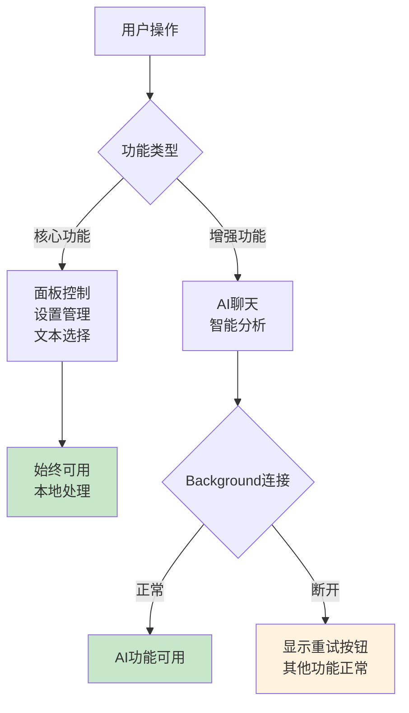

# isConnected 功能优化：从复杂检测到优雅降级

## 🤔 **问题背景**

在重构过程中遇到的错误：
```
TypeError: this.backgroundBridge.isConnected is not a function
```

这个错误揭示了一个重要的架构设计问题：**我们是否真的需要复杂的连接检测？**

## 📊 **原始架构的问题**

### **复杂的连接检测链**
```
ChatService.isConnected() 
  → ContentBridge.isConnected() 
    → BackgroundBridge.isConnected() 
      → 复杂的健康检查逻辑
```

### **问题分析**
1. **过度依赖连接状态** - 整个面板初始化依赖 Background 连接
2. **单点故障** - Background 断开导致所有功能不可用  
3. **初始化阻塞** - 连接检测失败阻止面板加载
4. **用户体验差** - 网络问题导致整个扩展不可用

## 🎯 **新架构的优雅降级**

### **设计理念**
> **让核心功能独立运行，AI功能作为增强**

### **功能分层**


## 🛠️ **具体实现**

### **1. 移除强制连接检测**

**之前（阻塞式）：**
```javascript
// 初始化时强制检查连接，失败则不加载面板
if (!assistantPanel.chatService.isConnected()) {
  throw new Error('AI服务未连接');
}
```

**现在（优雅降级）：**
```javascript
// 尝试连接AI服务，失败不影响面板加载
try {
  assistantPanel.chatService.setBridge(bridge);
  console.log('AI聊天服务已连接');
} catch (error) {
  console.warn('AI聊天服务连接失败，AI功能将不可用:', error);
  // AI功能不可用，但不影响其他功能
}
```

### **2. 简化连接状态检查**

**之前（复杂检测）：**
```javascript
isConnected() {
  return this.backgroundBridge.isConnected(); // 需要复杂的健康检查
}
```

**现在（简单判断）：**
```javascript
isConnected() {
  // 简单检查bridge是否存在，不进行复杂的连接测试
  return !!this.backgroundBridge && !!this.directBridge;
}

isAvailable() {
  // AI服务专用的可用性检查
  return this.#isAvailable && !!this.#bridge;
}
```

### **3. 智能重试机制**

```javascript
async tryReconnect() {
  if (!this.#bridge) return false;
  
  try {
    // 发送简单测试请求
    await this.#bridge.sendChatRequest({
      text: 'ping',
      type: 'test',
      isTest: true
    });
    
    this.#isAvailable = true;
    console.log('AI服务连接已恢复');
    return true;
  } catch (error) {
    this.#isAvailable = false;
    return false;
  }
}
```

## ✅ **优化效果对比**

### **可靠性提升**
| 场景 | 原架构 | 新架构 |
|------|--------|--------|
| Background 启动慢 | ❌ 面板无法加载 | ✅ 面板正常，AI功能稍后可用 |
| 网络连接问题 | ❌ 整个扩展不可用 | ✅ 本地功能正常，显示重试选项 |
| API 服务异常 | ❌ 初始化失败 | ✅ 其他功能不受影响 |

### **用户体验改善**
| 方面 | 原架构 | 新架构 |
|------|--------|--------|
| 加载速度 | 🐌 等待连接检测 | ⚡ 立即可用 |
| 错误提示 | 😵 技术性错误信息 | 😊 友好的功能状态 |
| 功能可用性 | 📱 全有或全无 | 🎛️ 渐进式增强 |

### **开发体验优化**
| 方面 | 原架构 | 新架构 |
|------|--------|--------|
| 调试难度 | 🔴 复杂的依赖链 | 🟢 独立的功能模块 |
| 错误定位 | 🔴 连锁失败难排查 | 🟢 问题隔离明确 |
| 代码维护 | 🔴 紧耦合 | 🟢 松耦合 |

## 🎯 **设计原则总结**

### **1. 优雅降级 > 强制依赖**
```javascript
// ❌ 不要这样做
if (!isFullyConnected()) {
  throw new Error('系统未就绪');
}

// ✅ 应该这样做  
try {
  enableAdvancedFeatures();
} catch (error) {
  showBasicFeaturesOnly();
  logErrorForLaterRetry(error);
}
```

### **2. 功能分层 > 单体架构**
```
🟢 核心层（本地功能）  - 始终可用
🟡 增强层（AI功能）    - 按需加载
🔵 扩展层（第三方集成） - 可选功能
```

### **3. 用户友好 > 技术精确**
```javascript
// ❌ 技术性错误
throw new Error('Background bridge connection timeout');

// ✅ 用户友好提示
showMessage('AI功能暂时不可用，请稍后重试', { 
  type: 'warning',
  action: 'retry' 
});
```

### **4. 渐进增强 > 完美主义**
- 先保证基本功能可用
- 再逐步添加增强功能
- 让每个功能独立健壮

## 🚀 **实际应用建议**

### **对于Chrome扩展开发**
1. **永远不要让网络请求阻塞UI初始化**
2. **将本地功能和远程功能分离**
3. **提供清晰的功能状态反馈**
4. **实现智能重试机制**

### **对于用户体验**
1. **快速响应比完美功能更重要**
2. **让用户知道发生了什么**
3. **提供解决问题的明确路径**
4. **保持核心功能的稳定性**

## 🎉 **结论**

通过这次优化，我们实现了：

- ✅ **更快的启动速度** - 不等待连接检测
- ✅ **更好的可靠性** - 网络问题不影响核心功能  
- ✅ **更清晰的架构** - 功能分层，职责明确
- ✅ **更友好的体验** - 优雅降级，智能重试

**关键思想：让扩展的价值不依赖于完美的网络条件！** 🌟 