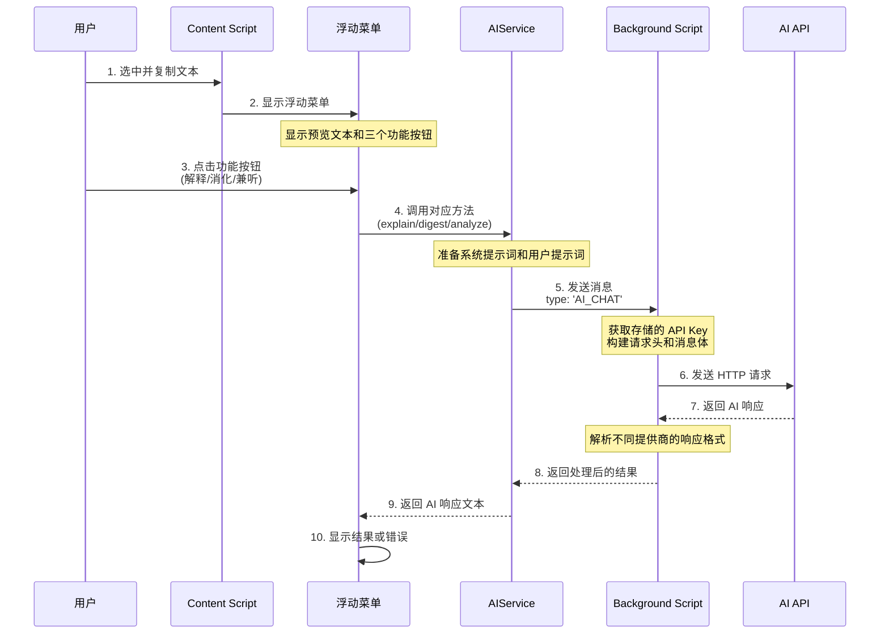

```mermaid
sequenceDiagram
    participant User as 用户
    participant Content as Content Script
    participant Menu as 浮动菜单
    participant Service as AIService
    participant Background as Background Script
    participant API as AI API

    User->>Content: 1. 选中并复制文本
    Content->>Menu: 2. 显示浮动菜单
    Note over Menu: 显示预览文本和三个功能按钮
    
    User->>Menu: 3. 点击功能按钮<br>(解释/消化/兼听)
    Menu->>Service: 4. 调用对应方法<br>(explain/digest/analyze)
    Note over Service: 准备系统提示词和用户提示词
    
    Service->>Background: 5. 发送消息<br>type: 'AI_CHAT'
    Note over Background: 获取存储的 API Key<br>构建请求头和消息体
    
    Background->>API: 6. 发送 HTTP 请求
    API-->>Background: 7. 返回 AI 响应
    Note over Background: 解析不同提供商的响应格式
    
    Background-->>Service: 8. 返回处理后的结果
    Service-->>Menu: 9. 返回 AI 响应文本
    Menu->>Menu: 10. 显示结果或错误
```
