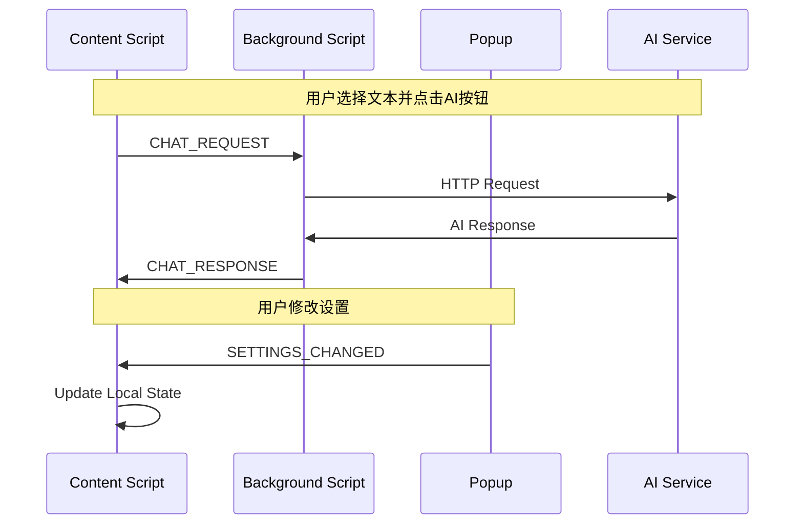
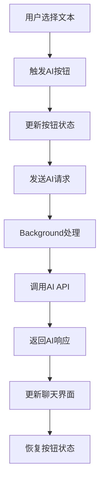
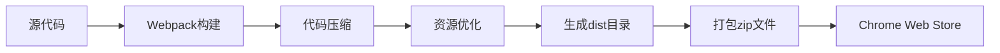

# 微信读书深度阅读助手 - 架构设计规格

## 📋 概述

本文档详细描述了微信读书深度阅读助手的技术架构、设计原则和实现细节。

## 🏗️ 整体架构

### 架构模式

采用 **分层架构 + 事件驱动** 的设计模式：

```
┌─────────────────────────────────────────────────────────┐
│                    用户界面层                              │
├─────────────────────────────────────────────────────────┤
│  Content Script UI  │  Popup UI  │  Background Service  │
├─────────────────────────────────────────────────────────┤
│                    业务逻辑层                              │
├─────────────────────────────────────────────────────────┤
│  AssistantPanel  │  ChatService  │  SettingsService     │
├─────────────────────────────────────────────────────────┤
│                    通信层                                 │
├─────────────────────────────────────────────────────────┤
│        BridgeService  │  MessageRouter  │  EventUtils    │
├─────────────────────────────────────────────────────────┤
│                    数据层                                 │
├─────────────────────────────────────────────────────────┤
│    Chrome Storage  │  Local State  │  AI API Services   │
└─────────────────────────────────────────────────────────┘
```

### 核心组件

#### 1. Content Script 环境
- **AssistantPanel**: 主面板组件，管理UI显示和交互
- **ChatComponent**: 聊天界面组件，处理对话显示
- **InteractiveComponents**: 交互组件（拖拽、调整大小等）
- **ContentBridge**: 内容脚本通信桥接

#### 2. Background Script 环境
- **MessageRouter**: 消息路由器，处理跨环境通信
- **ChatService**: AI聊天服务，处理AI请求
- **Background**: 主后台脚本，协调各种服务

#### 3. Popup 环境
- **PopupManager**: 弹出窗口管理器
- **SettingsUI**: 设置界面组件

#### 4. 共享模块
- **BridgeService**: 统一通信服务
- **SettingsService**: 设置管理服务
- **CONFIG**: 全局配置管理
- **MessageTypes**: 消息类型定义

## 🔄 通信架构

### 消息流向



### 消息类型定义

```javascript
// Background 消息类型（仅 AI 相关）
BACKGROUND_MESSAGES = {
  CHAT: {
    REQUEST: 'CHAT_REQUEST',     // AI 请求
    RESPONSE: 'CHAT_RESPONSE',   // AI 响应
    TEST_API_KEY: 'TEST_API_KEY' // 测试 API Key
  }
}

// 直接通信消息类型（Popup ↔ Content）
POPUP_MESSAGES = {
  SETTINGS: {
    GET: 'SETTINGS_GET',         // 获取设置
    SET: 'SETTINGS_SET',         // 保存设置
    CHANGED: 'SETTINGS_CHANGED'  // 设置变更通知
  },
  SYSTEM: {
    STATUS: 'SYSTEM_STATUS'      // 获取系统状态
  }
}
```

## 🎨 UI组件架构

### 组件层次结构

```
AssistantPanel (主容器)
├── Header (标题栏)
│   ├── BookInfo (书籍信息)
│   ├── ProviderInfo (服务商信息)
│   └── ActionButtons (操作按钮)
├── ChatContainer (聊天容器)
│   ├── MessageList (消息列表)
│   │   ├── UserMessage (用户消息)
│   │   ├── AIMessage (AI消息)
│   │   └── LoadingMessage (加载消息)
│   └── InputArea (输入区域)
│       ├── TextInput (文本输入框)
│       └── SendButton (发送按钮)
├── AIButtons (AI功能按钮)
│   ├── ExplainButton (解释按钮)
│   ├── DigestButton (消化按钮)
│   └── AnalyzeButton (兼听按钮)
└── InteractiveElements (交互元素)
    ├── DragHandle (拖拽手柄)
    ├── ResizeHandle (调整大小手柄)
    └── ModeToggle (模式切换)
```

### 组件状态管理

```javascript
// 组件状态结构
const ComponentState = {
  ui: {
    panel: {
      isShowing: boolean,
      mode: 'floating' | 'inline',
      position: { x: number, y: number },
      size: { width: number, height: number }
    },
    buttons: {
      explain: { loading: boolean, disabled: boolean },
      digest: { loading: boolean, disabled: boolean },
      analyze: { loading: boolean, disabled: boolean }
    },
    chat: {
      messages: Array<Message>,
      isLoading: boolean,
      inputValue: string
    }
  },
  user: {
    currentProvider: string,
    apiKeys: Object<string, string>,
    preferences: Object
  },
  system: {
    bookName: string,
    authorName: string,
    selectedText: string
  }
}
```

## 🔧 服务层设计

### ChatService (AI聊天服务)

```javascript
class ChatService {
  // 核心方法
  async sendMessage(options)      // 发送AI请求
  async testApiConnection(provider, apiKey)  // 测试API连接
  buildPrompts(action, text, book, author)   // 构建提示词
  
  // 私有方法
  #sendAIRequest(provider, apiKey, systemPrompt, userPrompt)
  #getApiKey(provider)
  #buildPrompts(action, text, book, author, context)
}
```

### BridgeService (通信桥接服务)

```javascript
class BridgeService {
  // 核心方法
  async sendMessage(type, data, options)  // 发送消息
  on(type, handler)                       // 注册处理器
  async broadcast(type, data)             // 广播消息
  
  // 私有方法
  #handleMessage(message, sender, sendResponse)
  #init()
  destroy()
}
```

### SettingsService (设置管理服务)

```javascript
class SettingsService {
  // API Keys 管理
  async saveAPIKeys(apiKeys)
  async loadAPIKeys()
  
  // 服务商管理
  async saveProvider(provider)
  async loadProvider()
  
  // UI状态管理
  async saveFloating(floating)
  async loadFloating()
  async saveMode(mode)
  async loadMode()
  
  // 私有方法
  #saveSettings(key, value)
  #loadSettings(key)
}
```

## 📊 数据流设计

### 数据流向



### 状态同步机制

```javascript
// 状态同步流程
1. 用户操作 → 本地状态更新
2. 本地状态更新 → 触发UI重渲染
3. 需要持久化的状态 → 保存到Chrome Storage
4. 需要跨环境同步的状态 → 发送消息通知其他环境
```

## 🔒 安全设计

### API Key 安全存储

```javascript
// API Key 存储策略
const SecurityStrategy = {
  storage: 'chrome.storage.local',  // 使用本地存储
  encryption: false,                // Chrome已提供加密
  access: 'background-only',        // 仅后台脚本访问
  transmission: 'never'             // 永不传输到外部
}
```

### 权限最小化原则

```json
{
  "permissions": [
    "storage"           // 仅存储权限
  ],
  "host_permissions": [
    "https://weread.qq.com/*"  // 仅微信读书域名
  ]
}
```

## 🚀 性能优化策略

### 1. 组件懒加载

```javascript
// 按需加载组件
const HelpModal = lazy(() => import('./help-modal/help-modal.js'));
const ChatComponent = lazy(() => import('./chat/chat-component.js'));
```

### 2. 消息防抖

```javascript
// AI请求防抖
const debouncedAIRequest = debounce(sendAIRequest, 300);
```

### 3. 缓存策略

```javascript
// 多层缓存
const CacheStrategy = {
  memory: new Map(),           // 内存缓存（会话级）
  storage: chrome.storage,     // 持久化缓存
  ttl: 5 * 60 * 1000         // 5分钟过期
}
```

### 4. 资源优化

```javascript
// Webpack优化配置
const optimization = {
  splitChunks: {
    cacheGroups: {
      vendor: {
        test: /[\\/]node_modules[\\/]/,
        name: 'vendors',
        chunks: 'all'
      }
    }
  }
}
```

## 🧪 测试策略

### 测试层次

```
┌─────────────────────────────────────┐
│           E2E 测试                   │  ← Chrome Extension 集成测试
├─────────────────────────────────────┤
│           集成测试                   │  ← 组件间交互测试
├─────────────────────────────────────┤
│           单元测试                   │  ← 单个函数/类测试
└─────────────────────────────────────┘
```

### 测试覆盖范围

1. **单元测试**
   - 工具函数测试
   - 服务类方法测试
   - 组件逻辑测试

2. **集成测试**
   - 通信机制测试
   - 状态管理测试
   - UI交互测试

3. **E2E测试**
   - 完整用户流程测试
   - 跨环境通信测试
   - 错误处理测试

## 📈 监控和调试

### 日志系统

```javascript
// 统一日志格式
const LogFormat = {
  prefix: CONFIG.LOG_PREFIX,
  level: 'info' | 'warn' | 'error',
  context: {
    component: string,
    action: string,
    data: object
  }
}
```

### 性能监控

```javascript
// 性能指标收集
const Metrics = {
  messageProcessingTime: number,
  aiResponseTime: number,
  uiRenderTime: number,
  memoryUsage: number
}
```

## 🔮 扩展性设计

### 插件化架构预留

```javascript
// 插件接口设计
interface Plugin {
  name: string;
  version: string;
  init(context: PluginContext): void;
  destroy(): void;
  
  // 生命周期钩子
  onBeforeAIRequest?(data: any): any;
  onAfterAIResponse?(response: any): any;
  onUIRender?(element: HTMLElement): void;
}
```

### 主题系统预留

```javascript
// 主题接口设计
interface Theme {
  name: string;
  colors: ColorPalette;
  fonts: FontConfig;
  spacing: SpacingConfig;
  
  apply(): void;
  remove(): void;
}
```

## 📋 部署和发布

### 构建流程



### 版本管理

```javascript
// 版本号规范：主版本.次版本.修订版本
const VersionStrategy = {
  major: '不兼容的API修改',
  minor: '向下兼容的功能性新增',
  patch: '向下兼容的问题修正'
}
```

---

## 📚 参考资料

- [Chrome Extension Manifest V3](https://developer.chrome.com/docs/extensions/mv3/)
- [Chrome Extension Architecture](https://developer.chrome.com/docs/extensions/mv3/architecture-overview/)
- [Web Components Best Practices](https://developers.google.com/web/fundamentals/web-components/best-practices) 